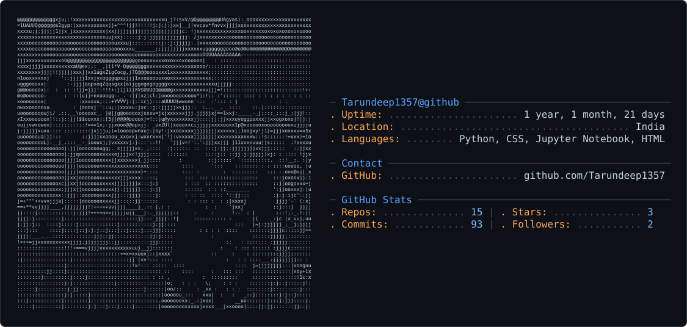

# Hi 👋, I'm Tarundeep Singh

🎓 BCA Student | Aspiring Machine Learning Engineer
💻 Passionate about AI, Web Development & Problem Solving

---

## 🚀 About Me

- 🎓 BCA Student passionate about Artificial Intelligence & Software Engineering  
- 🤖 Focused on becoming an AI Engineer with strong problem-solving and development skills  
- 🧠 Currently learning Machine Learning, Deep Learning, NLP, and AI Engineering  
- ⚡ Building real-world AI applications using Python, FastAPI, PyTorch, and React  
- 📊 Interested in LLMs, RAG systems, Computer Vision, and AI-powered products  
- 💻 Practicing Data Structures & Algorithms to strengthen core engineering skills  
- 🛠️ Exploring scalable backend development, APIs, Docker, and deployment workflows  
- 📚 Continuously improving through projects, open-source learning, and hands-on development  
- 🎯 Goal: Build impactful AI products and work as an AI Engineer in top product-based companies

<picture>
  <source media="(prefers-color-scheme: dark)" srcset="dark_mode.svg" />
  <source media="(prefers-color-scheme: light)" srcset="light_mode.svg" />
  
</picture>

# 💻 Tech Stack:
          
# 📊 GitHub Stats:
 
 

## 🏆 GitHub Trophies

### ✍️ Random Dev Quote

---

## 🐍 My Contribution Snake

  <picture>
    <source
      media="(prefers-color-scheme: dark)"
      srcset="https://raw.githubusercontent.com/Tarundeep1357/Tarundeep1357/output/github-snake-dark.svg"
    />
    <source
      media="(prefers-color-scheme: light)"
      srcset="https://raw.githubusercontent.com/Tarundeep1357/Tarundeep1357/output/github-snake.svg"
    />
    
  </picture>

<!-- Proudly created with GPRM ( https://gprm.itsvg.in ) -->
